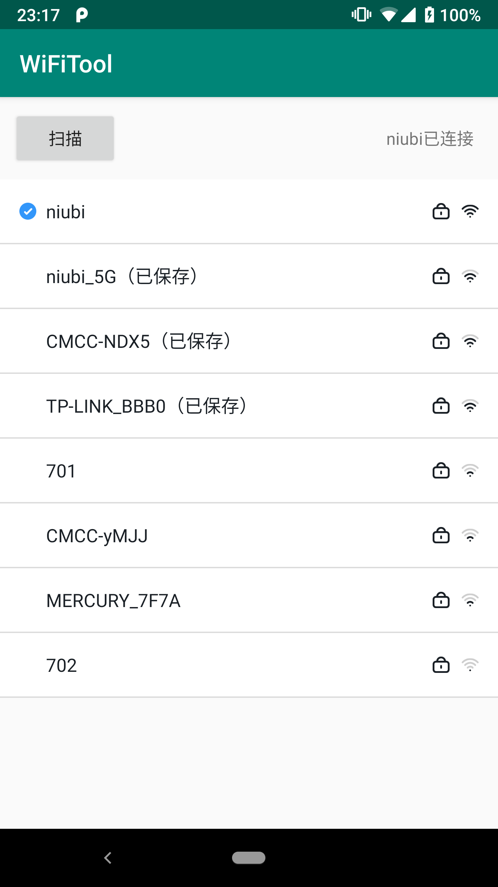
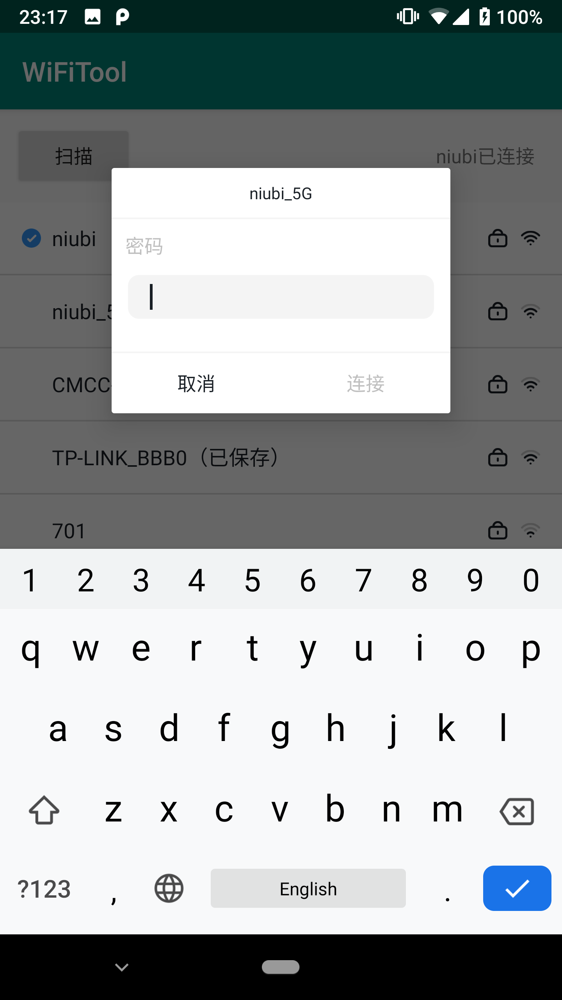
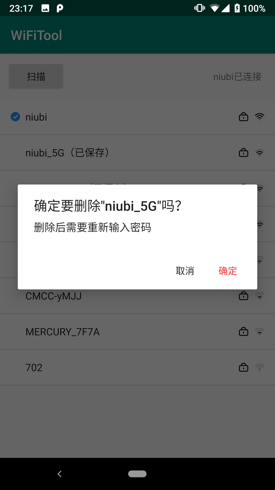

WiFiTool
=============
封装Android WiFi操作，提供获取WiFi列表、连接WiFi、删除WiFi等功能；

例图
---
<center class="half">
     
     
     
    
</center>

使用
---

1. 初始化

    首先导入 `WiFiTool` 库：

    ```gradle
     implementation 'com.darklycoder.lib:WiFiTool:1.0.1'
    ```

    申明权限：
    ```xml
     <uses-permission android:name="android.permission.ACCESS_COARSE_LOCATION" />
     <uses-permission android:name="android.permission.ACCESS_WIFI_STATE" />
     <uses-permission android:name="android.permission.CHANGE_WIFI_STATE" />
     <uses-permission android:name="android.permission.ACCESS_FINE_LOCATION" />
    ```

    接着进行初始设置，推荐在 Application 中进行： 

    ```java
     WiFiConfig config = new WiFiConfig.Builder()
        .setTimeOut(1000 * 4) //设置连接超时时间
        .build();
     WiFiModule.getInstance().setWiFiConfig(config);
     WiFiModule.getInstance().init(this);
    ```

2. 添加/移除监听
    
    在需要时添加监听，能够收到操作WiFi过程中的各种状态：
    ```
     WiFiModule.getInstance().addWiFiListener(TAG, mListener);
    ```

    在不需要的时候，可以移除监听，以免造成内存泄漏：
    ```
     WiFiModule.getInstance().removeWiFiListener(TAG);
    ```

3. 操作(Android 6.0以后需要定位权限才可以使用，所以不要忘记申请权限哦！)

    扫描列表：
    ```
     WiFiModule.getInstance().startScan();
    ```

    连接WiFi：
    ```
     WiFiModule.getInstance().connectWiFi(SSID, WiFiCipherType, password);
    ```

    移除WiFi：
    ```
     WiFiModule.getInstance().removeWiFi(SSID);
    ```

Demo
---
参考示例代码[app](https://github.com/DarklyCoder/WiFiTool/tree/master/app)