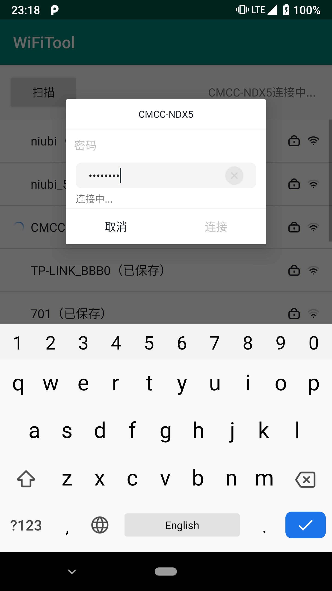

WiFiTool
=============
封装Android WiFi操作，提供获取WiFi列表、连接WiFi、删除WiFi等功能；

例图
---
   

使用
---

参考[wiki](https://github.com/DarklyCoder/WiFiTool/wiki)

Demo
---
参考示例代码[app](https://github.com/DarklyCoder/WiFiTool/tree/master/app)